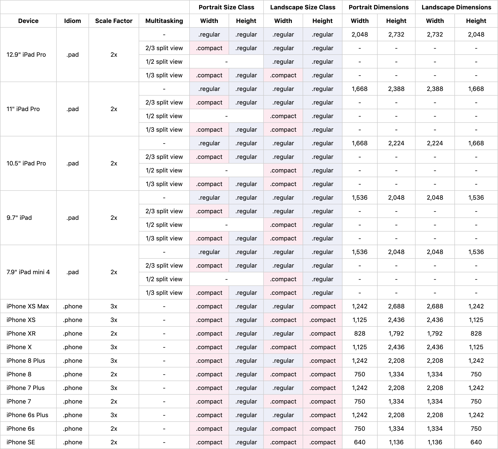

# Cheat Sheet for iOS Size Class

## Reference

[Human Interface Guidelines - Adaptivity and Layout](https://developer.apple.com/design/human-interface-guidelines/ios/visual-design/adaptivity-and-layout/) 
[Human Interface Guidelines - Image Size and Resolution](https://developer.apple.com/design/human-interface-guidelines/ios/icons-and-images/image-size-and-resolution/)

## Available Downloads
[Numbers](https://github.com/gumob/SizeClassCheatSheet/blob/master/SizeClassCheatSheet.numbers?raw=true)
[HTML](https://github.com/gumob/SizeClassCheatSheet/blob/master/SizeClassCheatSheet.html?raw=true)
[PNG](https://github.com/gumob/SizeClassCheatSheet/blob/master/SizeClassCheatSheet.png?raw=true)
[PDF](https://github.com/gumob/SizeClassCheatSheet/blob/master/SizeClassCheatSheet.pdf?raw=true)
